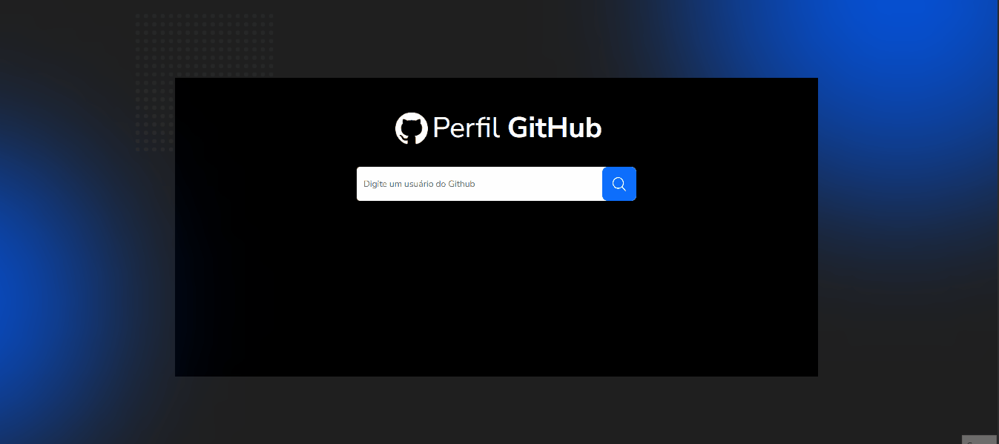

## DESAFIO 2 - 🚀 Projeto 02- Busca de Perfil no GitHub

📝 **Objetivo**: O desafio consiste em desenvolver uma aplicação React que permite buscar perfis do GitHub e exibir informações do usuário conforme o layout do Figma a baixo.

## 🛠 Tecnologias Usadas

- ✅ React.js
- ✅ Bootstrap 
- ✅ HTML5
- ✅ CSS3
- ✅ Figma 

🔗 **Acesse o layout no Figma abaixo:**  
[https://www.figma.com/proto/DqtFxC6312M32mLt8FpJjq/inovation-class?page-id=22%3A2864&node-id=22-4293&viewport=359%2C115%2C0.25&t=SHsEqEgaMrXGMKwv-1&scaling=scale-down-width&content-scaling=fixed&starting-point-node-id=22%3A4293&show-proto-sidebar=1](https://www.figma.com/proto/DqtFxC6312M32mLt8FpJjq/inovation-class?page-id=22%3A2864&node-id=22-4293&viewport=359%2C115%2C0.25&t=SHsEqEgaMrXGMKwv-1&scaling=scale-down-width&content-scaling=fixed&starting-point-node-id=22%3A4293&show-proto-sidebar=1)